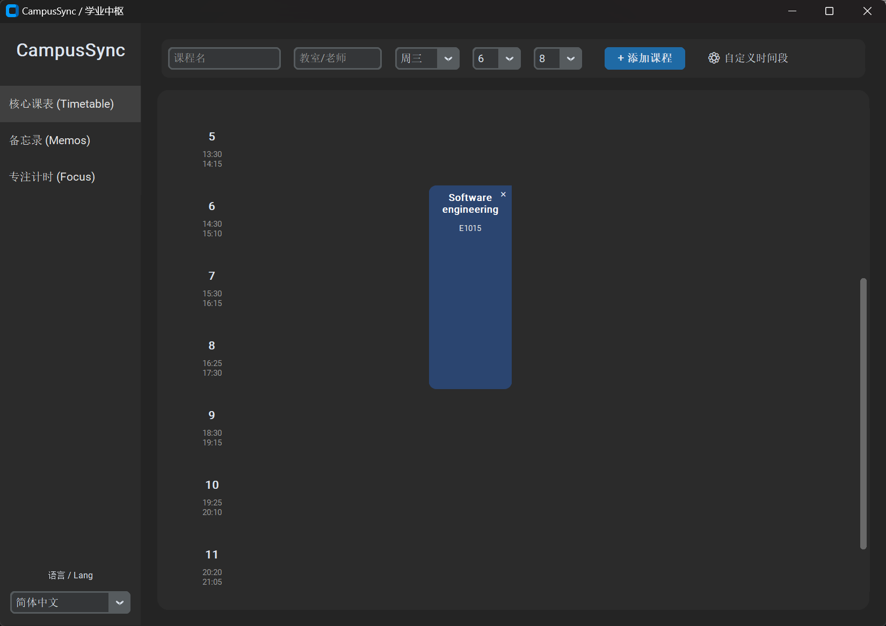
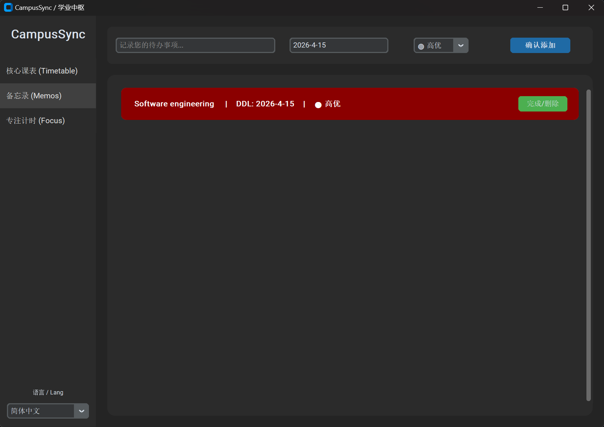
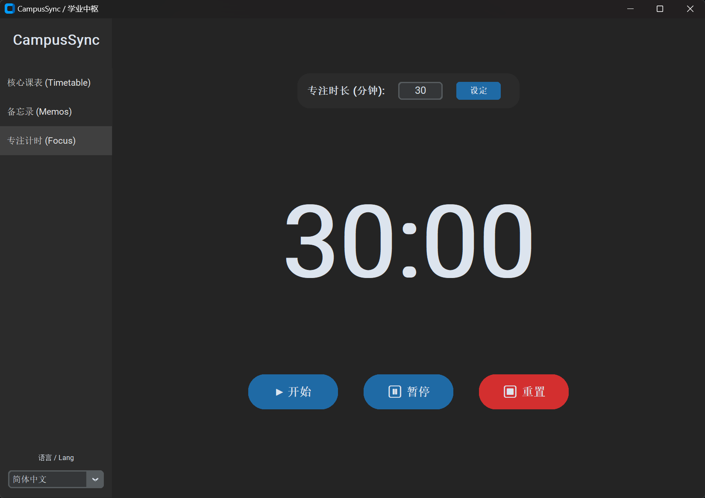

# CampusSync

> 🌐 [中文](./README.md) | [English](./README_EN.md) | [한국어](./README_KR.md)

> 一款面向大学生的本地化全能学业效率桌面应用，集课程表管理、备忘录与沉浸式专注计时于一体。

## Graphical Abstract






---

## 1. Purpose of the Software

### 1.1 Software Development Process

本项目采用 **Agile Scrum** 敏捷开发流程，以 Sprint 为单位进行迭代式交付。

### 1.2 Reason for Selection

| 因素 | 说明 |
|------|------|
| 需求不确定性 | 项目初期用户需求尚未完全明确，需在迭代中逐步收敛 |
| 快速反馈 | 每个 Sprint 结束后可获取可运行的增量版本，便于验证和调整 |
| 团队规模适配 | 小型团队（2-4 人）适用轻量级敏捷流程，减少文档开销 |
| 技术栈验证 | 需要在早期 Sprint 中快速验证 customtkinter 的 UI 可行性 |

### 1.3 Target Market & Usage

| 目标群体 | 使用场景 |
|----------|----------|
| 在校大学生 | 管理学期课表、记录作业截止日期、进行番茄钟专注学习 |
| 考研/考证备考者 | 利用专注计时功能进行高效的自律学习 |
| 注重隐私的用户 | 全部数据本地化存储，无需注册账户或联网 |

---

## 2. Software Development Plan

### 2.1 Development Process Model

项目按照 Scrum 框架组织，划分为 3 个 Sprint：

```
Sprint 1 (MVP)：核心架构搭建、课程表与备忘录基础功能
Sprint 2：专注计时器、时间段自定义、UI 打磨
Sprint 3：多语言 i18n 系统（中/繁/英/韩）、打包发布与文档撰写
```

### 2.2 Roles & Responsibilities

| 成员 | 职责领域 | 核心任务 |
| :--- | :--- | :--- |
| **Member A** | **核心架构 (Core)** | 负责数据持久层 (JSON)、主程序导航框架、以及最复杂的课程表网格渲染算法。 |
| **Member B** | **业务逻辑 (Logic)** | 负责备忘录模块、DDL 紧急度计算算法、以及 i18n 多语言系统的多维映射实现。 |
| **Member C** | **组件与交付 (DevOps)** | 负责专注计时器、自定义设置弹窗、全局 UI 视觉美化以及跨平台打包发布。 |

### 2.3 Project Schedule

阶段 | 周期 | 交付目标 |
| :--- | :--- | :--- |
| **Sprint 1** | 第 1 周 | **基础框架**：完成数据模型定义、多语言架构、导航栏及本地 JSON 读写逻辑。 |
| **Sprint 2** | 第 2 周 | **功能开发**：实现课程表动态渲染、备忘录排序逻辑、番茄钟倒计时核心。 |
| **Sprint 3** | 第 3 周 | **优化交付**：UI 全面美化、多语言文本适配、处理边缘 Bug 并完成 EXE 打包。 |

### 2.4 Core Algorithm

**紧急度排序与视觉预警算法**

备忘录列表采用双键复合排序策略：

```
排序键 = (优先级权重, DDL 日期)
优先级映射: 🔴高优→0, 🟡中优→1, 🟢低优→2
```

在渲染阶段，对每条记录执行如下判定：

```python
delta_days = (ddl_date - current_date).days
is_urgent = (delta_days <= 3) and (delta_days >= 0) and (priority == "高优")
```

当 `is_urgent == True` 时，该任务条目背景色切换为 `#8B0000`（深红），实现视觉预警。

**课程表网格渲染算法**

课程卡片通过 `grid(row=start_period, column=day_of_week, rowspan=span)` 实现跨行展示，其中 `span = end_period - start_period + 1`，确保课程块在 7×12 网格中的精确定位。

### 2.5 Current Status

* **📅 智能课表渲染**：支持 7×12 网格，自动计算 `rowspan` 跨行显示，界面丝滑不重叠。
* **🚨 智能预警备忘录**：独创 `Priority-DDL` 权重算法，过期或临近任务深度变红提醒。
* **⏳ 沉浸式番茄钟**：集成倒计时系统，支持自定义时长，适配高强度考研/考证场景。
* **🌍 国际化适配**：内置 4 种语言映射引擎，实现 UI 全文本无损实时切换。
* **🔐 隐私保障**：基于 `campus_data.json` 的本地持久化方案，数据不上传云端，保障个人隐私。

### 2.6 Future Plan

| 优先级 | 功能 | 说明 |
|--------|------|------|
| P0 | 数据导入导出 | 支持 JSON 文件的备份与恢复 |
| P1 | 学业分析仪表盘 | 基于专注计时日志生成学科投入时间统计 |
| P1 | 日历视图 | 月度格子视图，标记 DDL 与课程 |
| P2 | 跨平台支持 | 适配 macOS 与 Linux 打包 |
| P2 | 主题定制 | 支持浅色模式与自定义配色方案 |

---

## 3. Environments & Requirements

### 3.1 Programming Language

| 项目 | 版本 |
|------|------|
| Python | >= 3.8 |

### 3.2 Minimum Hardware Requirements

| 资源 | 要求 |
|------|------|
| RAM | >= 2 GB |
| 磁盘空间 | >= 200 MB（含打包后的可执行文件） |
| 显示器分辨率 | >= 1280 × 720 |

### 3.3 Minimum Software Requirements

| 平台 | 最低版本 |
|------|----------|
| Windows | 10 (64-bit) |
| macOS | 12 Monterey（源码运行） |
| Linux | Ubuntu 20.04（源码运行） |

### 3.4 Required Packages

| 包名 | 用途 | 许可证 |
|------|------|--------|
| `customtkinter` | 现代化 Tkinter UI 框架 | MIT |
| `darkdetect` | 系统暗色模式检测（customtkinter 依赖） | BSD-3 |
| `pyinstaller` | 桌面端可执行文件打包（仅构建时需要） | GPL-2.0 |

安装命令：

```bash
pip install customtkinter
```

---

## 4. Declaration

本项目在开发过程中使用了以下第三方开源软件与工具，均非本团队原创开发：

| 名称 | 类型 | 许可证 | 说明 |
|------|------|--------|------|
| [customtkinter](https://github.com/TomSchimansky/CustomTkinter) | UI 框架 | MIT | 提供现代化的 Tkinter 控件 |
| [darkdetect](https://github.com/albertosottile/darkdetect) | 系统工具库 | BSD-3 | 检测操作系统暗色/亮色模式 |
| [PyInstaller](https://github.com/pyinstaller/pyinstaller) | 打包工具 | GPL-2.0 | 将 Python 程序打包为独立可执行文件 |
| Python 标准库 (`json`, `uuid`, `datetime`, `os`, `sys`, `random`) | 运行时库 | PSF | Python 语言内置模块 |

本项目所有业务逻辑代码、UI 布局设计、i18n 翻译文本及文档均由团队成员独立完成。

---

## 5. Demonstration

### 5.1 Demo Video

[](https://youtu.be/ntVf8tTPNJ0)

### 5.2 How to Start & Run

#### 方式一：源码运行（开发模式）

```bash
# 1. 克隆仓库
git clone https://github.com/YOUR_USERNAME/CampusSync.git
cd CampusSync

# 2. 安装依赖
pip install customtkinter

# 3. 启动应用
python main.py
```

#### 方式二：运行预编译版本（Windows）

1. 前往 [Releases](https://github.com/YOUR_USERNAME/CampusSync/releases) 页面下载最新版本的 `CampusSync.zip`。
2. 解压后双击 `CampusSync.exe` 即可运行，无需安装 Python 环境。

> **注意**：应用首次启动时将在同级目录自动生成 `campus_data.json` 数据文件，请勿删除该文件以避免数据丢失。

---

## Project Structure

```
CampusSync/
├── main.py                 # 主程序入口
├── campus_data.json        # 本地数据存储（自动生成）
├── README.md               # 项目文档（中文）
├── README_EN.md            # 项目文档（English）
├── README_KR.md            # 项目文档（한국어）
├── docs/
│   └── abstract.png        # Graphical Abstract 图片
├── dist/                   # PyInstaller 打包输出
│   └── CampusSync/
│       └── CampusSync.exe
└── build/                  # 构建临时文件（不纳入版本控制）
```

---

## License

This project is licensed under the [MIT License](./LICENSE).
